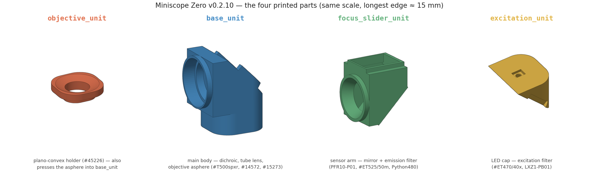
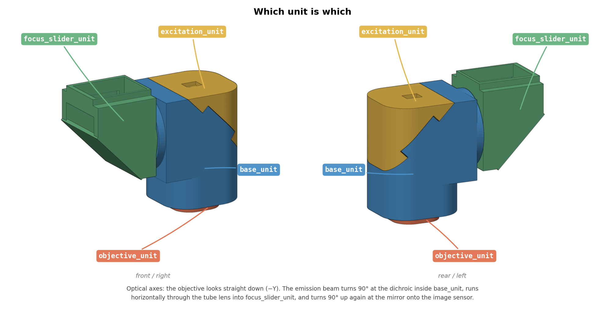
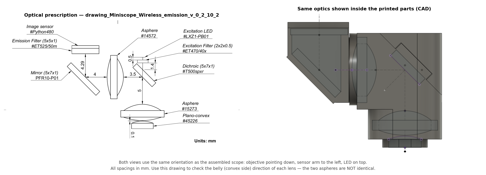
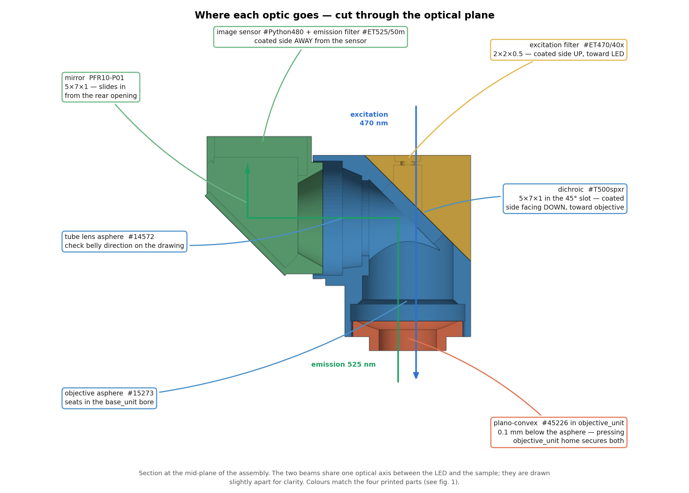
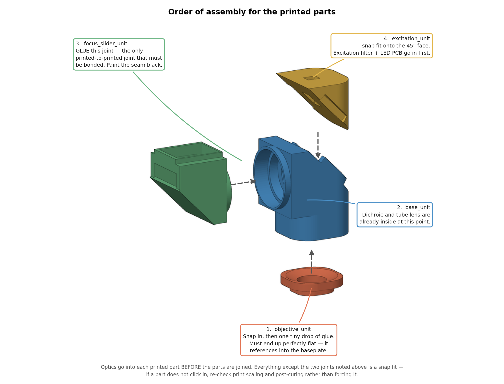

# Miniscope Zero — assembling the printed parts and optics

Version `v_0_2_10`. This guide covers the mechanical and optical assembly of the
scope body: the four printed parts, the two aspheres, the plano-convex lens, the
mirror, and the three filters. It assumes the PCBs (excitation LED board and
image sensor board) are already populated and tested.

Everything is small, most of it is snap-fit, and almost every failure mode is
either a scratched coating or a light leak. Work slowly and dry-fit before any
glue touches a part. **Wear gloves** — skin oils on a lens or filter surface are
hard to remove and scatter light exactly where you can least afford it.

---

## 1. The four printed parts

| Part | Holds |
|---|---|
| `objective_unit` | plano-convex #45226 |
| `base_unit` | dichroic #T500spxr, tube lens asphere #14572, objective asphere #15273 |
| `focus_slider_unit` | mirror PFR10-P01, emission filter #ET525/50m, image sensor #Python480 |
| `excitation_unit` | excitation filter #ET470/40x, excitation LED LXZ1-PB01 |

Assembled, they sit like this:

> **Note on `focus_slider_unit`:** this is a legacy name carried over from an
> earlier prototype. **It does not adjust focus.** Working distance is set by the
> height of the implanted baseplate. The name is kept only so that CAD files,
> STLs and older documentation stay cross-referenceable.

---

## 2. Consumables and materials

| Item | What we use | Notes |
|---|---|---|
| Optical adhesive | Norland Optical Adhesive 68 | UV-cure and reworkable. Always tiny droplets. |
| Black paint | Mousou Black (Koyo Orient Japan Co.) | For sealing seams and edges. |
| Black marker | Any black permanent marker (Sharpie) | Convenient for optic edges, but see below — often not black enough. |
| Fine brush | Any fine artist's brush | For applying black paint into small pockets and around edges. |
| UV source | Any 365–405 nm curing lamp | |

**Glue rule:** two tiny droplets in two places is always better than one large
droplet in one place. Excess adhesive wicks across clear apertures and fouls PCB
components. Norland 68 is reworkable — cured joints can be taken apart again,
which is precisely why we use it — but relying on that is still much more work
than dosing correctly the first time.

**Paint rule:** let black paint dry fully before handling or before the next
step. Build coverage from **several thin layers rather than one thick one** — a
thick layer stays soft underneath, creeps into places it should not be, and can
lift later.

---

## 3. Rules that apply to every optic

Read this section once before touching anything — it applies to all filters,
both aspheres, the plano-convex lens, and the mirror.

**Blacken the edges.** Coat the side faces (the ground edges, never the clear
apertures) of every filter, lens and the mirror before installation. Uncoated
edges scatter light around the optic and directly reduce contrast on the sensor.

A permanent marker is quick and fine for this, but **a Sharpie is often not
actually black enough** — it still transmits a surprising amount at these path
lengths. Where it matters, use **Mousou Black applied with a fine brush**
instead. Thin layers, fully dried.

**Identify the coated side.** Every filter has one coated surface and one that
looks more translucent. Coating orientation matters optically and is called out
per optic below. The coated surface is also the fragile one — **avoid scratches
on the coated side above all else.** Handle by the edges only.

**Aspheres are directional and not interchangeable.** The two aspheres
(#14572 and #15273) are **different lenses**, and each has a "belly" (convex
side) that must face a specific direction. Check the optical drawing every time:

**Nothing except the joints in section 5 needs glue.** All lenses and all
printed-to-printed interfaces are snap fits. If a part does not click in, the
answer is print scaling or post-curing — not force.

---

## 4. Populating each unit

Optics go into each printed part **before** the parts are joined together.

### 4.1 `excitation_unit` — excitation filter and LED

1. Drop the excitation filter **#ET470/40x (2 × 2 × 0.5)** into the pocket on the
   top face, **coated side up, toward the LED**. It must sit **flat** in the
   pocket — a tilted filter will not seal and will vignette the illumination.
2. If the fit is loose, one drop of UV glue will hold it.
3. Blacken the filter edges, **especially on the lower side** — the top opening
   where the LED sits is tight enough that light does not get in that way. A fine
   brush works well for applying the black paint here. This is the single most
   important light-leak control in the whole build: any excitation light that gets
   past the filter edge enters the emission path directly and shows up as a raised
   background floor on the sensor.
4. Glue the excitation LED PCB onto the top of the unit. Position the **LXZ1-PB01
   die carefully inside the opening** so it is neither tilted nor laterally
   offset — this is what determines illumination uniformity across the FOV later.

### 4.2 `base_unit` — dichroic and tube lens

1. Snap the tube lens asphere **#14572** into the horizontal bore. Check belly
   direction against the drawing.
2. Insert the dichroic **#T500spxr (5 × 7 × 1)** into the 45° slot, **coated side
   facing down, toward the objective**.
3. Secure the dichroic with UV glue on the **left and right sides only**. Never
   put adhesive anywhere the beam passes through.
4. Snap the objective asphere **#15273** into the bottom bore of `base_unit`.
   Check belly direction against the drawing. It is not clamped at this stage —
   pressing `objective_unit` (with the plano-convex in it) into the base is what
   finally secures it, so leave it seated and move on. See §5.

### 4.3 `focus_slider_unit` — mirror, emission filter, sensor

1. Insert the mirror **PFR10-P01 (5 × 7 × 1)** from the **rear opening**.
   One tiny droplet of glue.
2. **Seal the rear mirror opening** completely with glue and black paint. It is a
   wide opening and it faces the outside world — untreated, it is the largest
   ambient-light entry point on the scope.
3. Glue the emission filter **#ET525/50m (5 × 5 × 1)** onto the image sensor,
   **coated side away from the sensor**.
4. Glue and blacken around the filter so light can only reach the sensor through
   the coated aperture. Two details that matter here:
   - **Do not cover PCB components** on the sensor board with glue or paint.
   - Run a **≤ 1 mm strip of black paint around the flat face at the edge**, not
     just around the side edge of the filter. The side edge alone leaves a
     shallow path along the glass surface.
5. Insert the sensor (with filter attached) into the top pocket, then **glue and
   black-paint around the inserted sensor** so ambient light cannot enter around
   its perimeter.

---

## 5. Joining the printed parts

| Step | Joint | Treatment |
|---|---|---|
| 1 | `objective_unit` → `base_unit` | Holds the plano-convex #45226 and, by pressing home, **also secures the objective asphere #15273 already sitting in the base bore**. Snap in, then **one tiny drop of glue**. Keep it minimal: this part must end up perfectly flat, because it references into the baseplate. |
| 2 | `focus_slider_unit` → `base_unit` | **Glue.** This is the printed-to-printed joint that must be bonded. Black-paint the seam afterwards. |
| 3 | `excitation_unit` → `base_unit` | Snap fit onto the 45° face, then glue **only on the sides where it snaps into the lips / protrusions of `base_unit`**. Keep adhesive off the 45° mating face itself — that face sits directly over the dichroic slot. Black-paint the seam. |

Black paint every external seam once assembled, in thin layers, and let it dry
fully. The scope will often be used in an illuminated room.

---

## 6. Dark-field leak test

Do this **before** the scope goes anywhere near an animal.

1. Point the objective at nothing — a matte black surface, or a closed dark box.
2. Turn the **excitation LED on** at normal imaging power.
3. Acquire frames and look at the background.

Any structured or elevated signal on the sensor is excitation light reaching it
by a path other than the intended one. Trace it and paint it out — a leak here
sets a background floor that costs you SNR on every recording afterwards, and it
cannot be corrected in analysis.

Common culprits, in rough order of likelihood: the excitation filter's lower
edge, the rear mirror opening, the `focus_slider_unit`↔`base_unit` seam, and the
perimeter of the inserted image sensor.

---

## 7. Optics bill of materials

All dimensions in mm. See `img/fig4_optical_layout.png` for spacings.

| Optic | Part number | Size | Unit | Orientation |
|---|---|---|---|---|
| Objective asphere | #15273 | — | `base_unit` (bottom bore) | belly per drawing |
| Plano-convex | #45226 | — | `objective_unit` | 0.1 mm below #15273 |
| Dichroic | #T500spxr | 5 × 7 × 1 | `base_unit` | coated side down |
| Tube lens asphere | #14572 | — | `base_unit` | belly per drawing |
| Mirror | PFR10-P01 | 5 × 7 × 1 | `focus_slider_unit` | 45°, in from rear opening |
| Emission filter | #ET525/50m | 5 × 5 × 1 | `focus_slider_unit` | coated side away from sensor |
| Excitation filter | #ET470/40x | 2 × 2 × 0.5 | `excitation_unit` | coated side up, toward LED |
| Image sensor | #Python480 | — | `focus_slider_unit` | — |
| Excitation LED | LXZ1-PB01 | — | `excitation_unit` | die centred in opening |

## 8. Baseplate hardware

Full details in [`baseplate/baseplate_components.csv`](baseplate/baseplate_components.csv).

The set screw that locks the scope body into the implanted baseplate is
McMaster-Carr **`92311A317`**: an 18-8 stainless steel cup-tip set screw,
**2-64 UNF × 1/8 in long**, headless, **0.035 in (0.9 mm) hex drive**,
Rockwell B80, ASME B18.3, Class 3A fit. Sold in packs of 10.

For the driver we use a **Wiha 263P PicoFinish precision hex screwdriver,
0.9 mm / 0.035 in** (Wiha article `00520`; listed in the US catalog as `26343`,
0.9 mm hex with a 40 mm blade). Nothing depends on that exact model — any
precision driver or L-key that fits the 0.035 in / 0.9 mm hex will do. Do use a
driver that actually matches the hex rather than a Torx or star tip that merely
engages it: baseplate screws get loosened and retightened across sessions, and a
mismatched tip will round the socket out.
