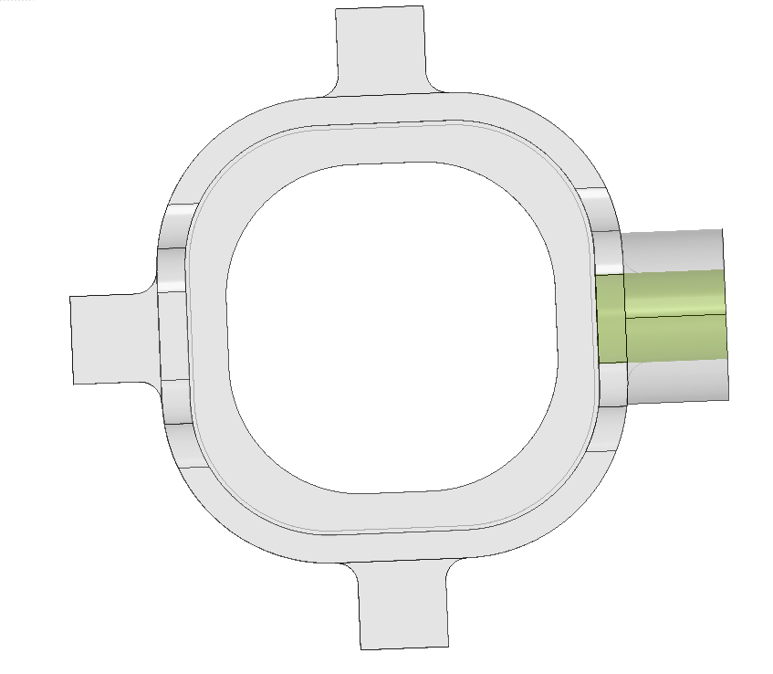

# Optics

Optical system of the Miniscope Zero head-mounted assembly: bill of materials,
mechanical drawing, optical design files, and housing/baseplate CAD.

## Contents

```
Optics/
├── optics_bom.csv    Bill of materials for the optical path
├── mechanical/       Dimensioned drawing of the optical assembly (Fusion 360 export)
├── zemax/            Ansys Zemax OpticStudio sequential-mode design files
├── housing/          3D-printed optical housing CAD
└── baseplate/        3D-printed baseplate CAD and hardware list
```

The housing holds the optical stack; the baseplate is cemented to the skull and
receives it. A set-screw mechanism sets the focal plane relative to the implanted
GRIN lens during baseplating, then locks it for subsequent recordings.

## Assembly

[`guides/optics_assembly.md`](../../guides/optics_assembly.md) is the build guide for the head-mounted assembly:
which optic goes into which printed part and in which orientation, edge
blackening and adhesive practice, the order the four printed parts are joined
in, and a dark-field leak test to run before the scope goes on an animal.

## Bill of materials

`optics_bom.csv` lists every element in the optical path. GitHub renders it as a
table in the web UI. The `ref` column keys each part to the mechanical drawing:

| ref | Element |
| --- | --- |
| `LED` | Excitation LED |
| `F_ex` | Excitation filter |
| `DM` | Dichroic beamsplitter |
| `L1`, `L2` | Objective (L2 is closest to the sample) |
| `L3` | Tube lens |
| `M1` | Fold mirror |
| `F_em` | Emission filter |
| `IS` | Image sensor |

Light path: `LED → F_ex → DM (transmitted) → L1 → L2 → sample`, then
`sample → L2 → L1 → DM (reflected 90°) → L3 → M1 (folded) → F_em → IS`.

Folding the path twice distributes the elements laterally rather than
vertically, keeping the assembly height low.

The `notes` column records where a part is **modified from stock** — the filters,
dichroic, and mirror are all diced down from larger catalog parts. Ordering the
stock part number alone will not give you a part that fits the housing.

Links in the `link` column point to the vendor part page, or to a vendor search
for the stock number where no stable product URL exists.

## Mechanical drawing

`mechanical/drawing_Miniscope_Wireless_emission_v_0_2_10.pdf` — dimensioned
layout of the optical stack, exported from Fusion 360 (design v0.2.10), with
element spacings in mm.

## Housing

`housing/` holds the 3D-printed optical housing (design v0.2.10):

- `Wireless_Miniscope_v_0_2_10.step` — all four bodies as exact solids. Use this
  to modify the design in any CAD package.
- `Wireless_Miniscope_v_0_2_10.f3d` — Fusion 360 archive with the design history.
- One STL per body, for printing:

| File | Body | Size (mm) |
| --- | --- | --- |
| `base_unit.stl` | Main chassis, tube-lens bore | 11.3 x 13.0 x 9.0 |
| `objective_unit.stl` | Objective lens holder | 7.9 x 2.1 x 7.9 |
| `excitation_unit.stl` | Excitation LED and filter arm | 7.6 x 7.6 x 9.0 |
| `focus_slider_unit.stl` | Set-screw focus slider | 8.4 x 10.0 x 8.0 |

The four parts print separately. Each STL is a single watertight, manifold shell
at the origin, so it can be oriented independently in the slicer.

Printed on a Formlabs Form 4 in Black Resin V5 at 25 um layer thickness.

## Baseplate and dust cap

`baseplate/` holds the skull-mounted baseplate and its dust cap. The two are
made differently:

| Part | Process | File to use |
| --- | --- | --- |
| Baseplate | CNC machined (Protolabs) | `baseplate.step` |
| Dust cap | 3D printed | `dust_cap.stl` |

The dust cap prints on the same settings as the housing: Formlabs Form 4, Black
Resin V5, 25 um layer thickness.

Baseplate machining specification (as ordered from Protolabs):

| | |
| --- | --- |
| Material | Aluminium 7075-T651 |
| Process | Mill |
| Dimensions | 14.59 x 5.99 x 14.89 mm |
| Tolerance | +/- 0.005 in (0.13 mm) |
| Edges | Broken; tool marks visible |
| Internal corners | Sharp, at minimum tool radius |
| Threading | 1 feature, UNF #2-64 |

The threaded bore is highlighted in green below. It takes the set screw that
locks the optical stack in the baseplate once the focal plane is set.



`baseplate.step` is the exact solid sent for machining; `baseplate.stl` is the
tessellated equivalent, for viewing and fit checks. `baseplate_and_dustcap.f3z`
is the Fusion 360 assembly archive for both parts.

`baseplate/baseplate_components.csv` lists the hardware that goes with it: the
McMaster-Carr `92311A317` set screw (18-8 stainless, cup tip, 2-64 UNF x 1/8 in,
0.035 in / 0.9 mm hex drive) and the precision hex driver used to turn it.

## Optical design

`zemax/` contains the sequential-mode OpticStudio models:

- `Miniscope_Wireless_emission_v_0_2_6_mirror_as_prism_2ndaspheric_14572.zmx`
  — emission path (the fold mirror is modelled as a prism).
- `Miniscope_Wireless_excitation_v_0_2_2.zmx` — excitation path.
- `emission_prescription_data.txt` — prescription dump of the emission model
  (surface data, NA, working F/#, track length), readable without OpticStudio.

`.ZDA` files are the matching OpticStudio session/analysis files.
