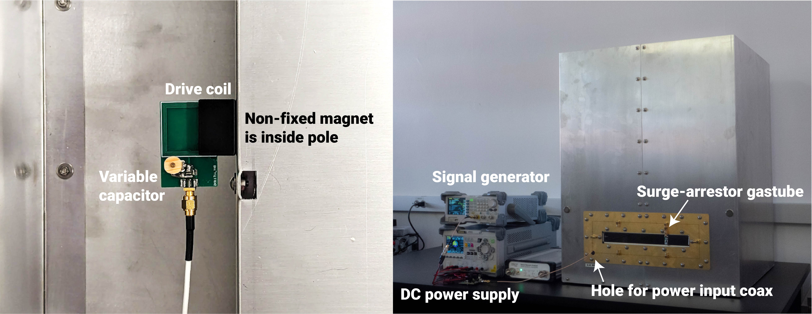
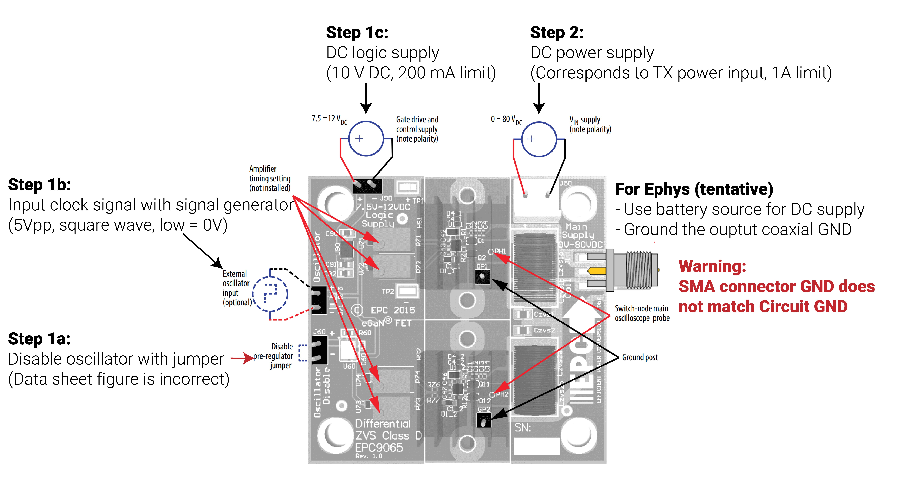
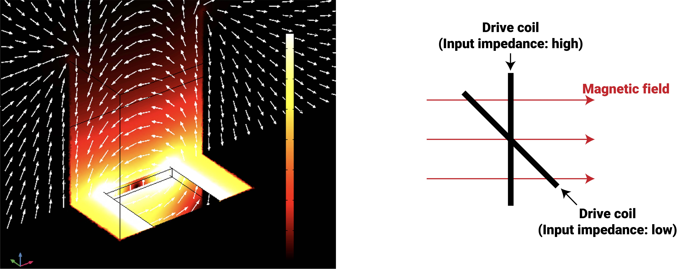

## Wireless power transfer cavity operation and assembly

### Drive coil connection
- Connect a coaxial cable to the drive coil.
- Pull the other end of the coaxial cable out of the cavity through the hole in the gold-plated capacitor mount PCB (power input coaxial cable).
- Attach the drive coil to the central pole.
    - **It is attached on the side in the photo, but it is usually better to attach this under the pole.**
    - The drive coil has a magnet embedded and can be attached to the pole using a non-fixed magnet within the pole.

### RF test/initial tuning
- Plug in the power input coaxial cable to a calibrated VNA (1-port measurement is ok)
- Measure the resonant frequency and Q-factor (optional) of the cavity and tune the drive coil

### [EPC9065](https://epc-co.com/epc/products/evaluation-boards/epc9065) connection

- Short the "Oscillator Disable" header with a jumper pin
- Connect signal generator output to "Oscillator" port
    - Square wave, 5V input (Low: 0V, High: 5V)
    - 6.63 MHz (Best if this can be checked with RF test/tuning)
- Connect DC power (Ch 1) to "Logic Supply" port
    - 10 V, 200 mA limit (should be around 100 mA)
- Connect DC power (Ch 2) to "Main Supply" port
    - This corresponds to DC input power to the cavity
- **Warnings**
    - EPC9065's output coaxial connector is **RP**-SMA (reverse-polarity SMA) so an adapter is needed to interface with standard SMA.
    - EPC9065's output coaxial connector's ground doesn't match with the actual circuit ground.

### Power ON/OFF sequence
- Turn on signal generator (clock input)
- Turn on DC power logic input channel
- Turn on DC power main supply channel **(wireless power turns ON)**
    - I recommend going from very low power levels and gradually turning up the power input.
        - Example: set a current limit of 0.8 A and gradually turn up voltage starting from 0 V
    - Input impedance changes with operating conditions (*e.g.*, current consumption, device/animal position) so **it is currently necessary to monitor the input power when operating. This will be automated in the future**
- If necessary, check if the cavity is generating magnetic field with the LED demo receiver
- Turn off DC power main supply channel **(wireless power turns OFF)**

## Tips/troubleshooting
### Tuning input impedance
- The input power changes depending on the input impedance, even if the input voltage is static.
- In the current setup, input impedance increases as the drive coil-to-cavity coupling increases.
    - Example: If input power is limited by the voltage limit (*e.g.,* 3 W = [30V, 0.1 A]), decrease the drive coil-to-cavity coupling by misaligning the drive coil. This will increase the input (*e.g.,* 9 W = [30V, 0.3 A])

### T-slotted mounting frames
Frame used for mounting the data receiver, behavior camera, etc.
- List of parts (frames are 20 mm * 20 mm)
    - 525 mm * 2
    - 480 mm * 4
    - 700 mm * 4
    - Corner brackets
    - Edge caps